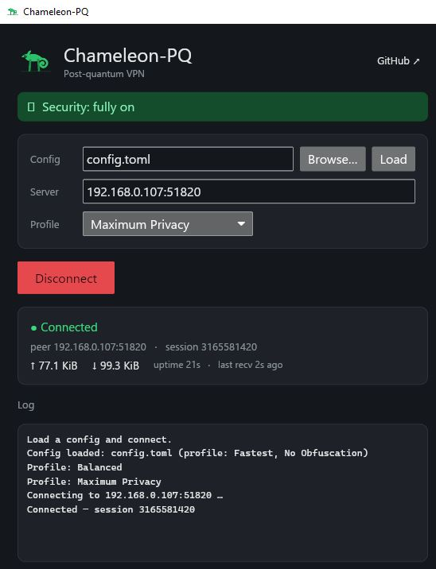

<p align="center">
  
</p>

# Chameleon-PQ

[](https://github.com/btdt1983/chameleon-pq/actions/workflows/ci.yml)
[](https://crates.io/crates/chameleon-pq)
[](https://github.com/btdt1983/chameleon-pq/releases)
[](LICENSE)

*🇬🇧 English | [🇩🇪 Deutsch](README.de.md)*

Experimental hybrid post-quantum VPN written in Rust. Combines ML-KEM-768 (KEM)
with X25519 for key agreement and a hybrid Ed25519 + ML-DSA-65 (FIPS 204)
signature for peer authentication, over UDP with a TUN interface on
Linux/macOS/Windows.

## Why post-quantum?

Almost all encryption in use today — the padlock on websites, VPNs, messaging
apps — relies on math (RSA, elliptic curves) that a large enough **quantum
computer** could break. Those machines don't exist yet, but they are being built.

The catch is **"harvest now, decrypt later"**: an adversary can record your
encrypted traffic *today*, store it, and simply wait — then decrypt it years
later once a quantum computer is available. So anything that has to stay secret
for a long time is already at risk, before quantum computers even arrive.

Chameleon-PQ is built for that world. It uses a **hybrid** design that combines
today's proven encryption (X25519) with a new **quantum-resistant** algorithm
(ML-KEM-768, standardised by NIST). Your traffic stays protected as long as
*either one* holds — so you gain defence against tomorrow's quantum computers
without giving up the security we already trust today.

## ⚠️ Security status: experimental — use at your own risk

Chameleon-PQ is **experimental** and has not undergone an **official,
independent security audit**. Any self-built cryptographic protocol should be
treated with caution until qualified reviewers have examined it, so **use it at
your own risk**. It makes a great learning project, architecture reference, or
starting point for a properly audited system — just not yet a drop-in production
VPN.

Known scope limits:
- No external security audit has been performed — this remains the single
  most important caveat for any self-built cryptographic protocol
- The **data path**, the **handshake envelope**, AND now **packet timing** are
  all obfuscated — every datagram looks like uniform random bytes, and optional
  traffic shaping (`[traffic]`, **off by default**; opt in via a profile —
  **Adaptive** paces during use, **CBR** for full constant-rate) sends on a
  fixed schedule with cover packets
  filling idle slots, so bursts and idle-vs-active dissolve into a steady
  stream. Residual (documented, not claimed as *full* resistance): the tunnel's
  existence and total duration are inherent to a fixed site-to-site link, the
  **initial** handshake burst is pre-pacer, and the handshake obfuscation key is
  pubkey-derived by default (`[obfuscation].psk_hex` closes that). Shaping has a
  real bandwidth/latency cost — the configured rate is both the floor (in CBR)
  and the
  throughput ceiling
- ML-DSA is integrated for authentication, but the key exchange still pairs
  ML-KEM-768 with X25519 (no second PQ KEM)

## What works

- Hybrid post-quantum handshake (ML-KEM-768 + X25519, both ephemeral → PFS)
- Mutual authentication: 3-message (2-RTT) handshake where both peers sign
  the transcript; the responder withholds trust until the initiator's
  Confirm verifies
- Return-routability cookie (WireGuard-style, stateless): the responder does no
  expensive ML-KEM/DH/ML-DSA work until the initiator echoes a cookie tied to its
  source address, so a spoofed/unverified source can't trigger the expensive
  handshake or a large reflected response. The CookieChallenge is a full-size
  obfuscated message, so it blends with the rest of the handshake
- Hybrid Ed25519 + ML-DSA-65 (FIPS 204) transcript signing for peer
  authentication (pre-shared identities) — the signature holds as long as
  *either* scheme is unbroken; falls back to Ed25519-only when no ML-DSA
  keys are configured
- Pluggable data-path AEAD: ChaCha20-Poly1305 (via `ring`, constant-time,
  the universal default) and AEGIS-256X2 (CAESAR winner, faster on CPUs
  with AES hardware), chosen by hardware-aware negotiation with the choice
  bound in the transcript against downgrade
- Obfuscated data path (QUIC-style header protection): every data datagram
  looks like uniform random bytes — no static type byte, no visible session_id,
  no visible monotonic counter. The header is masked with a keystream derived
  (via HMAC-SHA256) from a sample of the AEAD tag, and the real frame type is
  carried *inside* the encrypted payload, so keepalives are indistinguishable
  from data. Configurable length padding (off / bucketed / full) hides packet
  sizes. Header integrity still comes from the AEAD (the recovered header is the
  associated data), exactly as before — the mask is confidentiality-only
- Obfuscated handshake envelope (static-key, `hsobf.rs`): the handshake message
  is wrapped in a ChaCha20-Poly1305 layer keyed from the pre-shared identities
  (or an optional `psk_hex`) and split into size-jittered fragments with a
  masked header — the handshake burst no longer shows a constant type byte or a
  fixed fragment structure. The real handshake crypto is unchanged; this is a
  pure outer obfuscation layer (no forward secrecy on the obf layer)
- Timing / cover-traffic shaping (`pacer.rs`, `[traffic]`, opt-in, **off by
  default**): packets go out on a fixed schedule and empty slots are filled
  with cover (dummy) packets the receiver silently discards, so burst and
  idle-vs-active patterns are hidden. Cover packets are ordinary obf datagrams
  with an encrypted `Padding` inner type, constant-size under `Full` padding, so
  they are wire-indistinguishable from real data. Adaptive paces during
  activity + cooldown and goes quiet when idle (no bandwidth at rest); **CBR**
  streams constantly for the strongest hiding at a constant cost. No wire/proto
  change — a peer that predates this safely drops cover packets
- Per-direction keys; 2048-entry sliding-window replay protection
- Rekey with anti-storm gate, retry on packet loss, current+previous session
  overlap so in-flight traffic survives the swap
- Fragment reassembly with DoS-resistant pruning of stale partials
- Keepalive / dead-peer detection
- Cross-platform TUN: Linux, macOS, Windows (Wintun)
- **Kill switch** (client, full-tunnel, opt-in `tun.kill_switch`): a fail-closed
  firewall installed while connected, so if the tunnel drops nothing leaks to the
  physical NIC in cleartext — only loopback, the LAN, DHCP and the tunnel's own
  paths stay open. Unlike the RAII full-tunnel routes it *survives* an unexpected
  drop (that is the point) and comes down only on a deliberate disconnect or the
  `chameleon-pq killswitch off` escape hatch. nftables on Linux, Windows Firewall
  (default-outbound-block + per-path allow) on Windows
- **Desktop GUI client** (`chameleon-gui`, pure-Rust [iced]): a dark-themed
  Windows app — pick a config, connect / disconnect, live status, a friendly
  traffic-profile selector, and an in-app log, with no console window (see
  [Desktop client](#desktop-client-gui) below)
- Performance (no wire change): the data-path AEAD is auto-selected at startup
  by a quick benchmark (AEGIS-256X2 where it's fastest, ChaCha20 where AEGIS
  would fall back to slow software AES); UDP I/O uses GRO on receive and
  optional GSO on send (`[engine].gso`, **off by default** — it collapsed
  downloads on some paths, e.g. a Hyper-V vSwitch; via `quinn-udp`, per-packet
  fallback on old kernels / non-Linux) — a microbench lifts the send path from
  ~0.18 to ~9.6 Mpps; and the seal/open runs in parallel across all cores
  (rayon, `[engine].workers`), measured at ~4.5× (seal) / ~13× (open) on a
  12-thread box. Note: the parallel path helps the **fast mode** (the default
  `profile = "off"`); with timing-shaping on (opt-in) the configured rate caps
  throughput, so speed vs.
  timing-obfuscation are opposed dimensions you choose between
- 111 tests covering handshake (incl. mutual-auth + fragmentation), hybrid
  ML-DSA auth (and that a wrong PQ key fails even when Ed25519 matches),
  AEAD negotiation and AEGIS sessions, associated-data header binding, data
  path, replay (incl. wide reordering), MITM (both directions), rekey,
  prune behaviour, the obfuscated data path (round-trip on both ciphers,
  tamper rejection, trial-demux across current+previous sessions, length
  padding, empty keepalives, cleartext-handshake fall-through), and the
  obfuscated handshake envelope (symmetric key derivation, wrap-then-fragment
  round-trip with jitter, full mutual handshake, wrong-key/noise rejection,
  reassembler cap + prune, and that a 0.1.x cleartext frame is not accepted),
  timing/cover traffic (the pure pacer scheduler's CBR/Adaptive/cooldown logic,
  that a cover packet round-trips as `Padding`, and that cover and data are
  equal-length + header-distinct under `Full` padding), parallel crypto
  (parallel-sealed packets all decrypt with unique counters, and
  `decrypt_batch_par` classifies data vs noise), the reserve-then-seal
  outbound pipeline (out-of-order sealing against pre-reserved counters still
  decrypts correctly, concurrent reservations on the same session never
  duplicate a counter, a reserved counter survives a rekey landing before its
  seal, wire order matches submission order even when batches finish sealing
  in scrambled order, and a panicking rayon crypto job surfaces as an error
  instead of aborting the process), role-separated handshake
  signatures (a reflected responder signature is rejected as a Confirm, even
  under a shared identity key), the bounded UDP handshake (mutual completion
  over real sockets + a clean timeout when no responder answers), identity
  binding (symmetric, peer-dependent), low-order/all-zero X25519 rejection, and
  the return-routability cookie (deterministic + input-dependent, and a
  cookie-less Init is answered with a CookieChallenge, not an expensive Response),
  and the kill-switch firewall ruleset (a default-drop policy that permits only
  loopback, the tunnel transport, the TUN, LAN and DHCP, with the LAN rule
  omitted when the subnet is unknown, and unsafe interface names rejected)
- Fuzzing of the attacker-facing parsers (frame + handshake decode, the data-path
  and handshake obfuscation parsers, the reassembler, and the inbound
  decrypt path): a stable random + edge-case harness runs with `cargo test`
  (`tests/fuzz_parsers.rs`), plus coverage-guided `cargo-fuzz` targets in `fuzz/`
  (nightly; a weekly CI job). ~18 M executions across the targets found no panic
- End-to-end tunnel test (`tests/e2e_tunnel.rs`): the **real** tunnel loops
  (`tunnel_loops::run_tunnel_loops`) run on both sides over loopback UDP with a
  mock TUN, and plaintext flows both ways through the full handshake (incl. the
  L-4 cookie round-trip) → seal → GSO-send → GRO-recv → decrypt → TUN path

## Download

Prebuilt binaries are attached to every [release](../../releases/latest):

- **Windows** — `chameleon-pq-<version>-windows-x64.zip`: a self-contained bundle
  with the desktop GUI (`chameleon-gui.exe`), the CLI (`chameleon-pq.exe`), the
  Microsoft-signed `wintun.dll`, an example config, and setup notes. Unzip and
  run — nothing else to install.
- **Linux** — `chameleon-pq-linux-x86_64` (CLI).
- **crates.io** — `cargo install chameleon-pq` (CLI).

## Desktop client (GUI)

<p align="center">
  
</p>

Prefer click-to-connect over the command line? The Windows release ships a native
desktop client, **chameleon-gui**, built in pure Rust with [iced]:

- a dark theme with the chameleon logo and a matching taskbar icon;
- pick your `config.toml`, connect / disconnect, and watch live status;
- a friendly traffic-profile selector (Maximum Privacy · Balanced · High Speed ·
  Fastest) and an in-app log — with no console window in the background;
- a link straight to this repository from the header.

It's included in the self-contained Windows bundle above, and also builds from
source on Linux/macOS with `cargo build --release --manifest-path gui/Cargo.toml`.

[iced]: https://iced.rs

## Build

Requires a recent Rust toolchain (1.80+; install via
[rustup](https://rustup.rs/)).

```bash
cargo build --release
cargo test
```

Or install from crates.io:

```bash
cargo install chameleon-pq
```

## Quick start

```bash
# 1. Generate keypairs on both nodes
./target/release/chameleon-pq keygen

# 2. Copy config.example.toml to config.toml, fill in your seed and the
#    peer's public key (exchange these out-of-band)

# 3. Validate
./target/release/chameleon-pq --config config.toml check

# 4. Run as server (needs CAP_NET_ADMIN on Linux for TUN)
sudo ./target/release/chameleon-pq --config config.toml server

# 5. Run as client
sudo ./target/release/chameleon-pq --config config.toml client \
    --server 1.2.3.4:51820
```

On Windows you also need `wintun.dll` from <https://www.wintun.net> next
to the binary.

## Architecture

- `crypto.rs` — `Authenticator` trait with `Ed25519Auth` (via `ring`) and
  `MlDsaAuth` (ML-DSA-65 via `pqcrypto-mldsa`), combined by `HybridAuth`
  (all legs must verify); transcript hash, HKDF
- `aead.rs` — pluggable data-path AEAD: `ChaCha20-Poly1305` and
  `AEGIS-256X2` behind a trait (with associated-data support); a startup
  micro-benchmark auto-selects the faster cipher for the machine, and the
  choice is downgrade-safe (bound in the handshake transcript)
- `session.rs` — per-direction AEAD keys, nonce management, header binding
  via AAD, sliding-window replay, `SessionManager` with rekey
- `tunnel.rs` — 8192-byte handshake (single KEM slot, noise-padded; sized
  for the hybrid PQ signature), fragmentation/reassembly, state machine with
  transcript signing
- `frame.rs` — MTU-safe, magic-free frame (<1280 B) for the handshake
  envelope and the legacy (obfuscation-off) data path
- `obf.rs` — data-path obfuscation: QUIC-style header protection (13-byte
  header masked with a keystream derived from an AEAD-tag sample), inner
  type framing (real frame type encrypted inside the payload), and
  configurable length padding
- `hsobf.rs` — handshake-envelope obfuscation: a static key (derived from the
  pre-shared Ed25519 pubkeys, or an optional PSK) wraps the whole handshake
  message in ChaCha20-Poly1305 and splits it into size-jittered fragments with
  a masked header (`derive_hs_obf_key` / `seal_and_fragment` / `unmask_fragment`
  / `open`)
- `pacer.rs` — pure (tokio-free) constant-rate scheduler for timing/cover-traffic
  shaping: `Pacer::next_emit` decides per slot whether to send a real packet,
  a cover packet, or nothing (`ShapeMode` CBR/Adaptive); the async loop in
  `main.rs` drives it
- `engine.rs` — CPU encryption engine: batch seal/open, run **in parallel
  across cores** via rayon (`encrypt_batch_par` / `decrypt_batch_par`;
  `seal_batch_with_counters` for the reserved-counter outbound path, see
  `tunnel_loops.rs` below); constant-time, low-latency, no GPU path (see
  DESIGN.md §11–§12 for why)
- `net.rs` — UDP handshake wiring (initiator/responder, fragmentation, the L-4
  cookie) + the return-routability `CookieState`
- `tunnel_loops.rs` — the live tunnel loops (outbound / inbound + handshake-rekey
  demux / keepalive) as a reusable `run_tunnel_loops`, plus `TunnelParams`
  (owned config) and `TunnelStats` (live tx/rx counters); `main.rs` is a thin
  wrapper and a custom client can drive the same loop. Outbound crypto follows
  wireguard-go's own device pipeline: each drained batch reserves its AEAD
  counter range up front (one atomic op, fixing wire order immediately),
  seals in parallel on rayon's warm pool, and a dedicated sequential sender
  drains results strictly in reservation order — so a slower batch can never
  be overtaken on the wire by a faster later one. Inbound decrypt dispatches
  the same way but skips the ordering step (the replay window and TUN write
  order both tolerate reordering). Every `rayon::spawn` crypto job goes
  through a panic-catching guard (`rayon_spawn_guarded`): an unguarded panic
  in a rayon job aborts the whole process, not just one session
- `client.rs` — client-core: `Client::connect` (handshake + start the tunnel in
  the background) with live `Status`, `build_auth`/`hs_obf_key`, and
  `security_warnings` (secure-by-default: loudly flags a weaker config). The
  engine any frontend (CLI / GUI) reuses; it holds no crypto of its own
- `udp.rs` — batched UDP I/O (GSO on send, GRO on receive) via `quinn-udp`,
  with a per-packet fallback on older kernels / non-Linux; the only module that
  touches the dependency (`batch_send` / `batch_recv` / `group_equal_sized`)
- `rekey.rs` — rekey driver that solves the shared-socket problem
  (inbound loop is the sole socket reader; rekey driver receives via channel)
- `tun_iface.rs` — cross-platform TUN with mock for tests
- `config.rs` — TOML loader, CLI

## License

Apache 2.0 — see [LICENSE](LICENSE).
